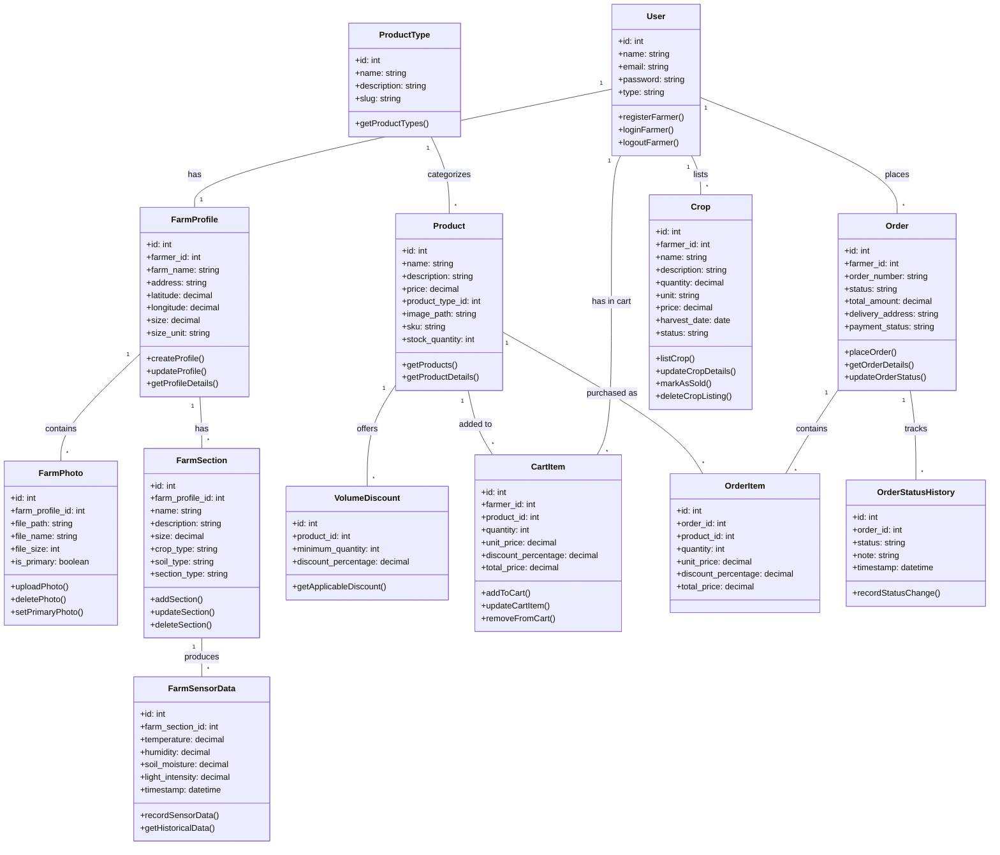
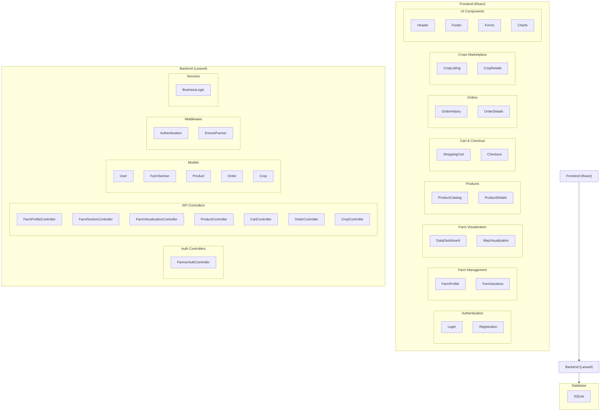
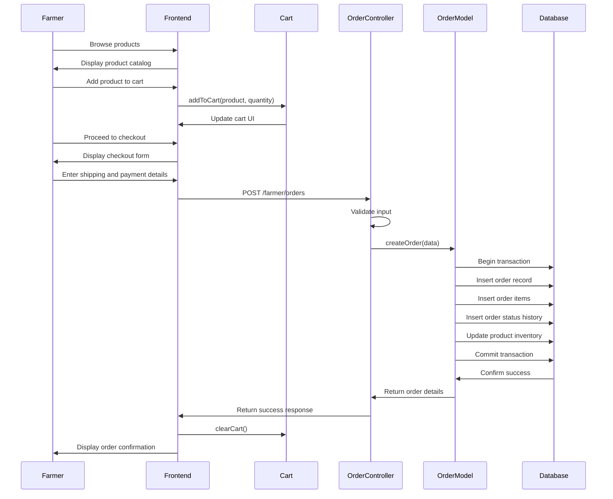
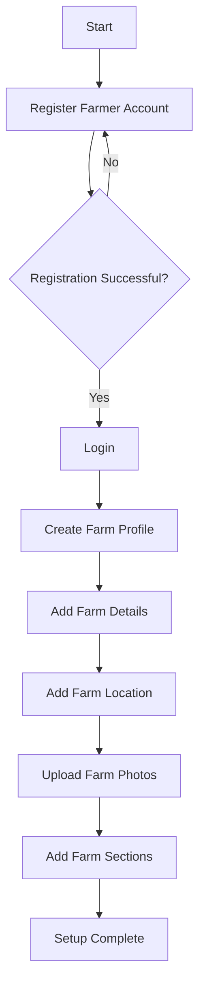
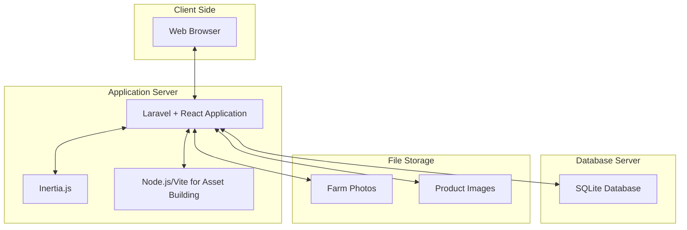

# FarmSmart UML Diagrams

This document contains UML diagrams showing the architecture and relationships in the FarmSmart application.

## Class Diagram



## Component Diagram



## Sequence Diagram - Order Placement




## Use Case Diagram

```mermaid
graph TD
    Farmer[Farmer]

    subgraph FarmSmart
        A[Manage Farm Profile]
        B[Manage Farm Sections]
        C[View Farm Visualization]
        D[Browse Products]
        E[Manage Shopping Cart]
        F[Place Orders]
        G[Track Order Status]
        H[List Crops for Sale]
        I[Manage Crop Listings]
    end

    Farmer --> A
    Farmer --> B
    Farmer --> C
    Farmer --> D
    Farmer --> E
    Farmer --> F
    Farmer --> G
    Farmer --> H
    Farmer --> I

    Admin[Administrator]

    subgraph AdminFunctions
        J[Manage Products]
        K[Process Orders]
        L[View Sales Reports]
        M[Manage Farmers]
    end

    Admin --> J
    Admin --> K
    Admin --> L
    Admin --> M
```



## Activity Diagram - Registration and Farm Profile Setup



## Deployment Diagram


```